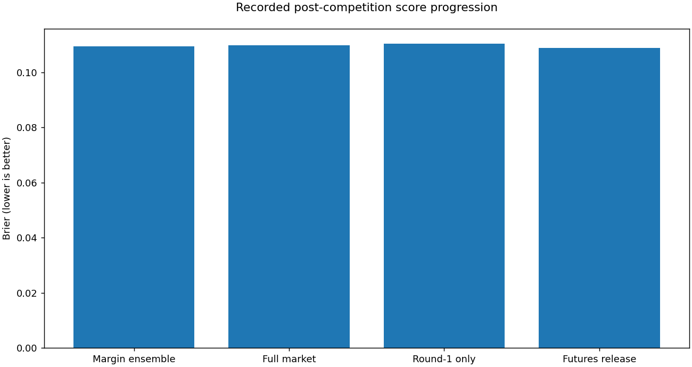

# NCAA tournament forecasting | ML engineering case study

**Alvaro Mendizabal · probability forecasting · controlled research · cloud ML engineering**

## Achieved result: 0.1094899 Brier

The retained release achieved **0.1094899 Brier** in recorded post-competition Kaggle
scoring, numerically below the published 2026 winning benchmark of **0.1097454** by
**0.0002555**. This is a late-submission comparison, not an original first-place finish.

**[Open the executed case study](portfolio/current_research.ipynb)** ·
[Employer walkthrough](docs/employer_walkthrough.md) ·
[Current evidence](reports/current_research/release_decision.json)

| Evidence | Result | Decision |
|---|---:|---|
| Retained scored release | **0.1094899** | Keep |
| Previous release | 0.1098691 | Improved by the retained release |
| Subsequent women's extension | 0.1105237 | Rejected; champion unchanged |

## What the project demonstrates

**Research judgment.** Feature expansion, dimension reduction, chronological subset
selection, target comparisons and ensemble experiments were evaluated against controlled
references. Margin supervision yielded a complementary men's forecast and a better
scored release. A later women's extension passed historical checks but lost when scored;
that negative result is preserved rather than hidden.

**Statistical care.** Whole-season assessments, training-only transformations, matched
controls and probability diagnostics address the forecasting problem. Repeatedly used
development seasons are not described as untouched tests. The distinction between a
historical gain and an achieved Kaggle score is visible throughout the case study.

**Reliable execution.** Checksummed prediction files, protected-row contracts, resumable
model artifacts and at-most-once submission attempts protect completed work. The latest
replay reused all 45 candidate models, performed zero new fits and made no new upload.
Every one of the achieved men's prediction lines stayed unchanged in the rejected candidate.

**Technical communication.** The executed notebook has six inline Plotly figures and
embedded static fallbacks. A reviewer can inspect the evidence without AWS access.

## Scope and completion

The achieved release and its review are complete milestones. Ongoing private research
is not declared finished: feature selection is model- and objective-specific, and
leading-solution coverage is not exhaustive. No 0.09 score or future advantage is claimed.
The next bounded study investigates the successful model's representation, not another
upload of the rejected candidate. [Evaluation boundaries](docs/current_research.md)
explain what the evidence does and does not establish.

**Public case study, not a current training distribution.** New forecasting implementation,
feature formulas, fitted models, tuning recipes, raw data and AWS changes remain outside
this update. The small report program only renders approved aggregate evidence. Earlier
public code, repository history and existing licenses remain accessible; this update does
not make those materials confidential. [Publication policy](docs/REPOSITORY_POLICY.md).

For [2027 readiness](docs/2027_readiness.md), freeze a private baseline, audit season-specific
inputs and record forecasts before future outcomes arrive. More late-score optimization is
not a substitute for prospective evidence. No 2027 competition rules or dates are assumed.

The compact reference is credited to [Harrison Horan's first-place solution](https://www.kaggle.com/c/march-machine-learning-mania-2026/writeups/march-machine-learning-mania-2026-1st-place-solut).
Historical evidence and the [earlier scored collection](reports/final_results/README.md)
remain intact. This is benchmark-informed applied ML research, not a claim of universally
state-of-the-art forecasting.
