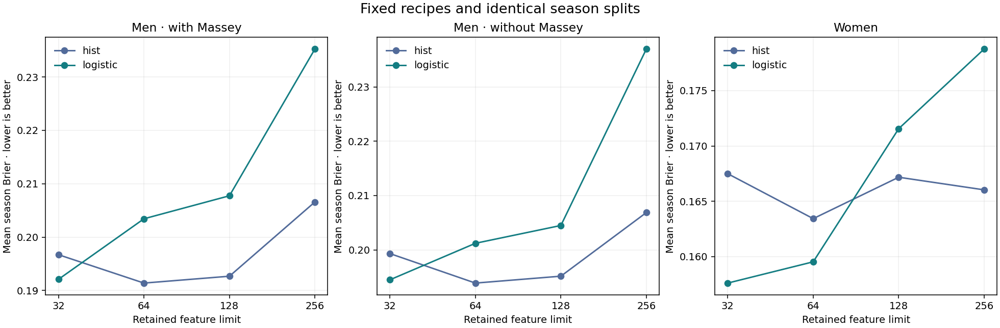
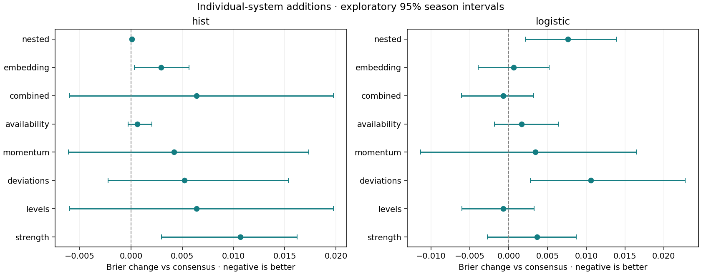

# NCAA tournament probability forecasting

[](https://github.com/alvaromendizabal/march-machine-learning-mania-2026/actions/workflows/ci.yml)

**How much can basketball feature engineering improve tournament forecasts?**
This project tests that question across men's and women's NCAA tournaments using
season-aware validation, 3,946 candidate definitions, controlled ablations and
reproducible model comparisons.

**The result:** compact team-strength and consensus-ranking features are competitive.
A much wider feature bank does not deliver a consistent improvement. The project
shows how to find useful signal, reject unstable gains and preserve the evidence
behind a modeling decision.

**Current delivery:** the research release and
[50-file prediction batch](reports/prediction_production/README.md) are complete.
Each distinct file contains 132,133 matchups. All 33 saved models reproduced their
predictions exactly. The versioned S3 archive is verified; fresh remote recovery
reused 344 checkpoints with zero fits and 50 byte-identical files. The completed
delivery gates are recorded in the [completion plan](docs/completion_plan.md).
Start with the
[short employer walkthrough](docs/employer_walkthrough.md) for the key findings
and a trace from input receipts to the reference CSV.

## Review the work in five notebooks

All notebooks contain executed outputs. Open them directly on GitHub; reviewing
the project requires no setup, AWS account or GPU. Plotly figures are interactive
in Jupyter and include static images for GitHub.

| Notebook | The question it answers |
|---|---|
| [00 · Data](notebooks/00_data_audit_and_preparation.ipynb) | Which official files exist, and what are their coverage and quality limits? |
| [01 · Validation](notebooks/01_split_protocol_and_pre_tournament_snapshots.ipynb) | What information is available before each prediction, and how are seasons separated? |
| [02 · Feature research](notebooks/02_feature_store_and_diagnostics.ipynb) | Which basketball mechanisms help, which fail, and when should the search stop? |
| [03 · Models](notebooks/03_model_comparison_and_diagnostics.ipynb) | How do logistic regression, boosting, calibration and blends compare on the same features? |
| [04 · Evaluation](notebooks/04_locked_benchmark_and_final_submission.ipynb) | How do the frozen recipes perform, and how are predictions generated and validated? |

[05 · Research appendix](notebooks/05_feature_research.ipynb) compares the earlier
and expanded runs. It is optional reading.

## What the experiments established

The main study contains **3,106 candidates**: 124 existing inputs, 2,944
recency/distribution/venue/opponent/trajectory/peer hypotheses, 26 coach-history
signals and 12 conference-strength signals. An additional study tests **840
individual-ranking definitions** from 105 systems cataloged before 2013.

The main full-bank fits retain **128 inputs each**, screened only on the applicable
training population. Across their 20 outer fits, 251 distinct inputs survive;
2,855 never enter those full-bank models. This is a collection of fold-specific
selections, not a global feature list. The complete
[release audit](reports/repository_release/repository_release_audit.json) reconciles
candidate counts, rejection reasons, fitted selections and current run fingerprints.

| Experiment | Completed evidence | Decision |
|---|---|---|
| Basketball feature families | 1,050 ablation fits, including no-Massey and temporal encoding/coach controls | Keep useful compact strength and consensus signals; report uncertain or harmful additions |
| Model comparison on the exact expanded matrix | 861 candidate fits with nested temporal selection | Broader features do not consistently beat compact models |
| Retained feature limits: 32, 64, 128, 256 | 168 evaluated fits; 138 new and 30 reused controls | Increasing capacity generally fails to help |
| Individual rankings, disagreement, momentum, availability and PCA | 112 evaluated fits; 92 new and 20 reused controls | No promotion after forward-only selection |
| Frozen logistic anchors on 2022–2025 | 16 annual fits on an already-consumed benchmark | Retrospective diagnostic evidence; no holdout tuning |

Holding the histogram estimator fixed, adding compact ranking consensus improves
men's mean-season Brier by **0.010687** versus strength alone (exploratory 95%
season interval: −0.016580 to −0.002978). The corresponding logistic gain is smaller
and uncertain. This is a measured feature effect; it does not establish that the
entire expanded bank is better. [Paired ablations](reports/feature_store/ablation_intervals.csv)
include both add-family and remove-family controls.

### More retained inputs did not reliably improve forecasting



Each panel uses the same five development seasons. Lower Brier is better.
Keeping 256 features hurts the men's models; reducing the screen can improve a
broad model without beating the compact leaders. The
[capacity study](reports/feature_capacity/README.md) includes forward-only selection,
matched-game intervals and reproducible controls.

### A small apparent gain failed the temporal selection check



Points left of zero favor the added representation. The intervals resample seasons
and are exploratory, not adjusted for the many comparisons. Individual ranking
levels reduce fixed logistic mean-season Brier from **0.187608 to 0.186924**, but
the interval crosses zero. Selecting a representation using earlier seasons gives
**0.195240**, worse than the consensus control. The
[individual-system study](reports/ranking_systems/README.md) keeps that negative
result visible; its nominal winner is not promoted.

## Performance and its limits

The [competition](https://www.kaggle.com/competitions/march-machine-learning-mania-2026)
uses **Brier score**: the mean squared error of predicted win probabilities.
Lower is better; an uninformative 50% forecast scores 0.25. Mean-season Brier gives
each season equal weight; game-weighted Brier gives each game equal weight.

| Evidence | Men: mean-season Brier | Women: mean-season Brier |
|---|---:|---:|
| Best observed nested development stream | 0.188396 · no-Massey pooled blend | 0.144823 · separate logistic |
| Frozen seeded logistic anchors, retrospective 2022–2025 | 0.198288 | 0.146881 |

Development uses 2016–2019 and 2021. These years were explored during research,
and **2022–2025 was already consumed in earlier work**. Neither is a new untouched
holdout. The observed development leaders are not an unbiased estimate of a
subsequently selected winner. Local evaluation includes play-ins and differs from
Kaggle's scored population. This is a retrospective portfolio project.

On the retrospective seeded anchors, men's/women's ROC AUC is **0.7512 / 0.8715**,
log loss **0.5791 / 0.4385**, and 10-bin calibration error **0.0481 / 0.0665**.
[Audited metrics](reports/repository_release/repository_release_audit.csv) are
recomputed from saved predictions, including both Brier definitions.

The available official-data feature search is complete. The evidence does **not**
establish that the expanded bank improves on all earlier models. Player
availability, returning production and women's coach/rating parity lack verified
historical sources in this snapshot. A meaningful extension needs independent,
timestamped inputs or a future tournament evaluated under a frozen protocol.

## Engineering and release evidence

- **Temporal integrity:** day-132 snapshots, strictly earlier-season target and
  coach histories, training-only screening/PCA, whole-season validation, and
  mutation tests that reject leakage and stale downstream results.
- **Reproducibility:** locked Python environment, typed modular code, explicit
  failure tests, source/data/model fingerprints, UTC progress logs and heartbeats.
- **Recovery:** versioned S3 archives preserve data, estimators, forecasts and
  source. Verified recovery reused 901 model tasks; the two feature follow-ups
  separately reused 281 tasks and preserved 280 models without new fits.
- **Publication:** six canonical notebooks and 44 executed code cells. The
  [native handoff receipt](reports/validation/production_handoff.json) verifies
  their source, checkpoint hashes and saved outputs. The required quality workflow
  checks 301 tests, release audits, native execution and six-notebook reuse.
  The badge above links the checks for the current revision.

On September 9, 2026 UTC, all six research archive versions were rechecked against
AWS. Five full-object SHA-256 checksums matched directly; the remaining archive
was freshly downloaded and hashed. The
[cloud receipt](reports/repository_release/cloud_verification.json) records exactly
what was verified. The [research audit](docs/research_audit.md) preserves the full
experimental reasoning, release history and limitations.

## Reproduce or generate predictions

```bash
uv sync --locked --group dev
uv run --locked python -m ipykernel install --user --name march-mania
uv run --locked python scripts/quality.py
uv run --locked python -m march_mania.publication.release --check
uv run --locked python -m march_mania.publication.portfolio --check
uv run --locked python -m march_mania.publication.production_release --check
uv run --locked python scripts/notebook.py --execute --publish
```

The release audit checks the committed publication before notebook execution.
Rerunning notebooks can change timestamps and environment outputs; intentionally
publishing new bytes requires refreshing their native validation receipt and audit.

The current 50-file generator uses the expanded research lineage:

```bash
uv run --locked python -m march_mania.publication.production --restore-inputs
uv run --locked python -m march_mania.publication.production --generate
```

These commands require authorized access to the existing private input archives.
The [production report](reports/prediction_production/README.md) gives exact
recipes, file checksums and verified remote recovery evidence.

Notebook 04 audits the completed batch in review mode. Set `RESTORE_PRODUCTION`
to retrieve its fifty files without fitting, or use the separate default-off
`GENERATE_PORTFOLIO` control to run the frozen pipeline. The existing
`GENERATE_SUBMISSION` control generates the single reference from local 02/03 runs. Historical 124-feature final artifacts retain their
original identity. Neither path uploads a submission to Kaggle.

After restoration or portfolio generation, notebook 04 also prepares one download
containing all fifty CSVs, their manifest and frozen recipe. Every CSV retains its
recorded checksum. The equivalent entry point is
`uv run --locked python scripts/deliver_predictions.py --action restore`.
Repeat requests reuse a verified packaging checkpoint.

[Studio and resume instructions](docs/studio.md) cover training with private data
and automatic archive recovery. Existing Studio checkouts use
`python3 scripts/update.py`; the script preserves local notebook edits before updating.
Git contains code, executed notebooks and compact evidence; raw data and trained
binaries remain in private storage.

MIT-licensed code. Competition data remains subject to Kaggle's terms.
