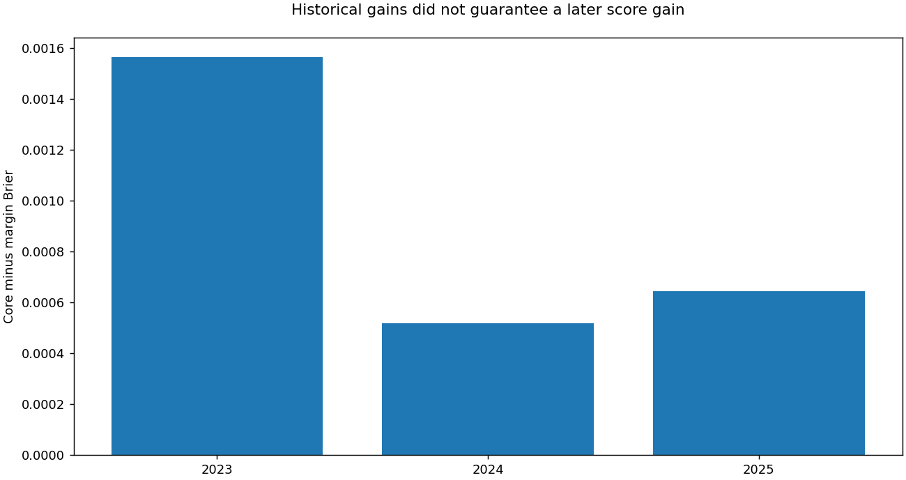

# NCAA tournament probability forecasting

**Alvaro Mendizabal · temporal validation · basketball representations · calibrated ensembles**

A notebook-led ML research project that progressed from compact win/loss models to
complementary score-margin supervision, with controlled experiments and a scored release.

## Start here

**[Open the executed research case study](portfolio/current_research.ipynb)** ·
[Two-minute employer walkthrough](docs/employer_walkthrough.md) ·
[Methods and limitations](docs/current_research.md)

| Evidence | Brier — lower is better | Interpretation |
|---|---:|---|
| **Current recorded late submission** | **0.1094899** | Fixed men's margin blend; Kaggle submission 56447505, COMPLETE |
| Previous scored incumbent | 0.1098691 | Improvement of 0.0003792 |
| Published first-place benchmark | 0.1097454 | Our late score is numerically lower by 0.0002555; not an original competition placement |
| Women's historical screen | 0.1387757 | 504 games; improved from 0.1405293; not a new Kaggle score |

The achieved late score and historical validation are different evaluation settings.
A lower post-competition number does not establish prospective superiority or retroactive
first place. [Current score identity and research progression](reports/current_research/progression.json)
record the exact scored file hash, observations, source returns and evaluation populations.



## Research finding

Adding more features did not automatically help. Full feature fusion, residual PCA,
chronological subset selection and frozen-core corrections were rejected. Training a
complementary model on actual point margins, rather than only wins, produced a useful
fixed blend. Matched binary-target controls isolate the target's contribution.

The men's blend passed fuller-ensemble testing before one candidate build and one score
test. Only 2,278 seeded-men matchups changed; 129,855 prediction lines remained unchanged,
including every women's line. The newly scored artifact remains frozen in AWS.

The separate women's transfer screen passed all eight criteria, improving six of eight
historical seasons. Its next milestone is three-seed, whole-season-omission robustness,
not an automatic submission. Reused development years and calibration limitations remain
explicit. Negative findings are retained in the notebook rather than hidden.

## Review the work

| Artifact | What it demonstrates |
|---|---|
| [Current case study](portfolio/current_research.ipynb) | Eight saved Plotly charts, achieved score, negative results, matched-target ablation, seed/year stability, women's transfer |
| [Data audit](notebooks/00_data_audit_and_preparation.ipynb) | Identifiers, input integrity and preparation |
| [Split protocol](notebooks/01_split_protocol_and_pre_tournament_snapshots.ipynb) | Whole-season assessment and point-in-time boundaries |
| [Feature diagnostics](notebooks/02_feature_store_and_diagnostics.ipynb) | Domain representation and controlled comparisons |
| [Model comparison](notebooks/03_model_comparison_and_diagnostics.ipynb) | Earlier model lineages, calibration and diagnostics |
| [Research index](research/README.md) | Broader engineering and experiment history |

## Reproduce this publication without AWS

```bash
uv sync --locked --group dev
uv run --locked python -m ipykernel install --user --name march-portfolio
uv run --locked python -m unittest discover -s portfolio -p 'test_current_research.py'
uv run --locked python portfolio/current_research.py --check
uv run --locked python portfolio/current_research.py --build --kernel march-portfolio
```

The report reads committed aggregates, performs no training or downloads, and has
embedded image fallbacks for static review. Interactive Plotly outputs are retained for
compatible Jupyter front ends. Saved/reopened output checks block incomplete publication.

## Deliberate publication boundary

**GitHub is the curated evidence and engineering layer. AWS is the experimental workspace.**
This update does not mirror raw competition records, feature caches, fitted models,
per-game private artifacts, environments, credentials or uncommitted AWS work. Full
training reproduction needs the retained authorized inputs and current AWS source state;
the portable notebook reproduces its own aggregate analyses, not model training.

The [earlier 70-submission release](reports/final_results/README.md), with its historical
0.1222672 best, remains unchanged and is not presented as the current result. Earlier
aggregate evidence remains in evidence.json; progression.json records the later score
and women's screen. Existing repository quality checks remain intact.

**Completed:** scored men's margin release, bounded women's screen and current research publication.
**Next decision:** women's fuller-ensemble validation; one subsequent frozen build and
separately authorized score test only if justified. No guarantee of another improvement.

The compact reference is adapted from
[Harrison Horan's first-place writeup](https://github.com/harrisonhoran/kaggle-march-mania-2026-1st-place/blob/main/kagglewriteup.md).
Existing license and third-party notices remain unchanged. Our adaptation and limitations
are documented in the methods note.
