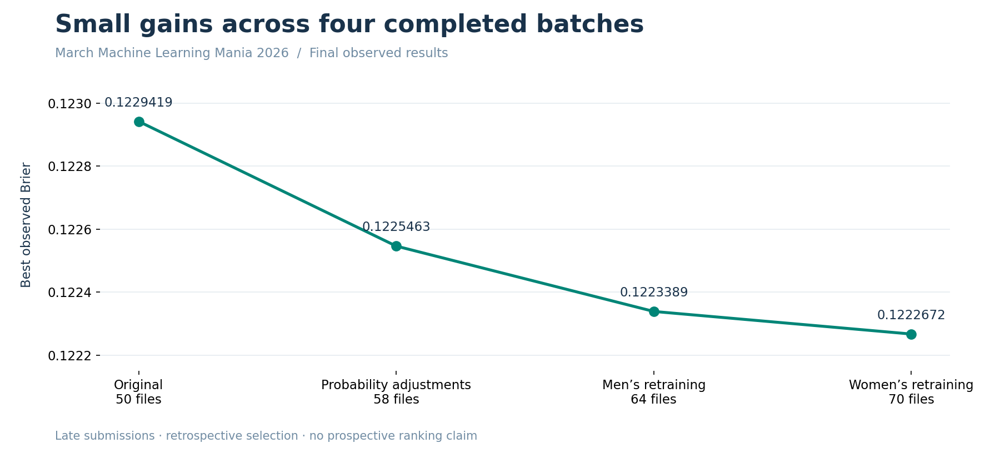

# NCAA tournament probability forecasting

**Final observed Brier: 0.1222672 · 70 scored submissions · Project complete**

Predicting NCAA tournament outcomes with temporal feature engineering, separate
men’s and women’s models, calibrated probability comparisons, and reproducible ML engineering.

[](https://github.com/alvaromendizabal/march-machine-learning-mania-2026/actions/workflows/ci.yml)

The best submitted model combines **men’s pooled XGBoost at temperature 0.90** with
**women’s conference logistic regression, C=1.0, at temperature 1.10**. Both Kaggle
score columns display **0.1222672**, improving on the original model pair’s
**0.1229419**. All 70 current CSVs and their scores are preserved.
These were **late, retrospective submissions**. The score is an observed result,
not a prospective competition rank or an untouched-holdout estimate.


**Start here:** [two-minute employer walkthrough](docs/employer_walkthrough.md) ·
[final results and exact model lineage](reports/final_results/README.md) ·
[complete score ledger](reports/final_results/kaggle_scores.csv)

## What this project demonstrates

The central question is whether broader basketball feature engineering improves
win probabilities enough to justify the additional complexity. Across **3,946
candidate definitions**, compact team-strength and ranking representations remained
competitive. Larger feature banks and more trees did not consistently improve
results under earlier-season selection. Positive and negative findings are preserved.

| Capability | Evidence |
|---|---|
| Domain feature research | 3,106 basketball/coach/conference candidates and 840 individual-ranking definitions; controlled add/remove-family ablations |
| Temporal validation | Pre-tournament day-132 snapshots, earlier-season target and coach histories, training-only screening, whole-season folds |
| Probability modeling | Logistic regression, histogram boosting, XGBoost and LightGBM; calibration, blending, Brier, log loss and ranking diagnostics |
| Reproducible production | Locked dependencies, explicit seeded/seed-free routes, unique official IDs, team-swap symmetry and exact model reload checks |
| Recovery and delivery | Versioned private artifacts, content-verified checkpoints, UTC logs and heartbeats, 70 original-byte submission files |
| Engineering review | Typed Python, 355 tests in the required workflow, six executed canonical notebooks and documented PRs |

## Final model and score

| Stream | Fitted model | Final training | Probability adjustment |
|---|---|---|---|
| Men | Pooled XGBoost; 120 trees, depth 2, 128 retained inputs | 1,575 men’s and women’s tournament games, 2013–2025 | Temperature 0.90 |
| Women | Logistic regression; conference feature block, C=1.0 | 772 women’s tournament games, 2013–2025 | Temperature 1.10 |

Canceled 2020 is excluded. Both streams have seeded and seed-free estimators;
seed-derived inputs are removed before seed-free screening. The men’s pooled
stream excludes Massey and retained no coach inputs. Women’s separate final model
retains 16 seeded inputs and 15 seed-free inputs. No 2026 tournament outcome enters
fitting or prediction. Temperature choices and the final winner were selected
retrospectively from observed results; the original development reference remains frozen.

The winning file is
`m_pooled_xgboost_t090__w_conference_c100_t110.csv`.
Its [record](reports/final_results/summary.json) connects the observed score to the
exact CSV hash, fitted components and training audits. Each CSV has **132,133 rows**.
The original 18 legacy score observations remain separately labeled by their earlier lineage.



Interactive versions of these charts, every scored submission and the complete
ledger are in the [Plotly report](reports/final_results/results.html). Download and
open the HTML in a browser; it includes its plotting dependencies. Notebook 04
also contains interactive Plotly outputs with static previews for GitHub.

## Review the notebooks

All notebooks contain executed outputs. Review requires no private data, cloud
account or GPU. Follow the five-notebook path; notebook 05 is an optional appendix.

| Notebook | Review question |
|---|---|
| [00 · Data](notebooks/00_data_audit_and_preparation.ipynb) | What official data exists, and what are its coverage and quality limits? |
| [01 · Validation](notebooks/01_split_protocol_and_pre_tournament_snapshots.ipynb) | What information is available before each prediction? |
| [02 · Features](notebooks/02_feature_store_and_diagnostics.ipynb) | Which basketball hypotheses help, and which fail controlled tests? |
| [03 · Models](notebooks/03_model_comparison_and_diagnostics.ipynb) | How do models, calibration and bounded challengers compare on matched games? |
| [04 · Results](notebooks/04_locked_benchmark_and_final_submission.ipynb) | What was submitted, what scored best, and how are exact predictions recovered? |
| [05 · Appendix](notebooks/05_feature_research.ipynb) | How does the current study compare with the earlier feature schema? |

## Findings and limitations

- **Massey coverage was checked.** Legal men’s ranking and coach coverage is complete
  throughout modeled 2013–2026 snapshots. In matched XGBoost controls, adding Massey
  improves historical Brier from 0.193306 to 0.192201; removing coach features then
  gives 0.191808. These conditional effects are uncertain and trail the pooled leader.
  Women’s comparable ranking/coach histories are unavailable in this snapshot.
- **Broader is not automatically better.** The feature-capacity study evaluates
  32, 64, 128 and 256 retained inputs. Individual ranking additions and larger banks
  do not establish a stable gain. [Feature evidence](reports/feature_store/README.md)
  and [bounded retraining](reports/xgboost_retraining/README.md) retain the comparisons.
- **Historical metrics are distinct from Kaggle scores.** On explored development
  seasons, the best nested men’s/women’s mean-season Brier is 0.188396 / 0.144823.
  The frozen logistic anchors on the consumed 2022–2025 benchmark score
  0.198288 / 0.146881. Those populations and protocols differ from the final Kaggle evaluation.
- **Selection uncertainty remains.** Women’s historical temperature winner did not
  win on Kaggle. The final submitted winner was third in the bounded historical
  shortlist. Small retrospective gains are not evidence of reliable future improvement.
- **Coverage is not validation.** Seed-free predictions cover the official template
  but lack matched tournament out-of-fold validation. No new untouched holdout or
  leaderboard rank is claimed.

## Reproduce or recover

```bash
uv sync --locked --group dev
uv run --locked python -m ipykernel install --user --name march-mania
uv run --locked python scripts/quality.py
uv run --locked python -m march_mania.publication.release --check
uv run --locked python scripts/final_report.py --check
uv run --locked python scripts/notebook.py --execute --publish
```

Notebook 04 reviews the final results by default. Explicit, default-off controls
restore or generate predictions; ordinary review does not fit models or create
submission CSVs. [The final handoff](reports/final_results/README.md) documents the
70-file collection, its recovery location and the winning file. Existing generation
recipes, prediction bytes and their original receipts remain preserved.

The [native publication receipt](reports/validation/final_results.json),
[research audit](docs/research_audit.md), [completed release gates](docs/completion_plan.md)
and [Studio instructions](docs/studio.md) provide deeper verification and recovery details.
Git contains source, compact evidence and executed notebooks; raw inputs, trained
estimators and full prediction archives remain in private versioned storage.

**Release complete:** the final winner, score history, models, submissions and
review materials are preserved. A future tournament under a frozen protocol is a
separate research extension, not unfinished work in this release.

MIT-licensed code. Competition data remains subject to Kaggle’s terms.
