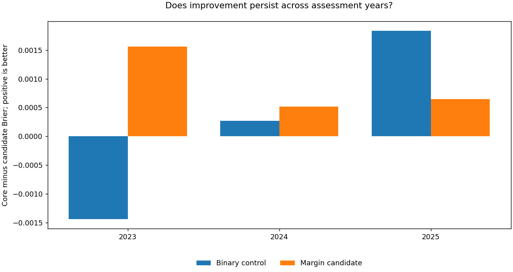

# NCAA tournament forecasting | ML engineering case study

**Alvaro Mendizabal · sports forecasting · rigorous evaluation · cloud ML engineering**

## Achieved result: 0.1094899 Brier

A scored, post-competition NCAA forecasting system with a recorded Brier score of
**0.1094899**, numerically below the published 2026 winning benchmark of **0.1097454**.
The difference is **0.0002555**, or approximately **0.23% lower Brier**. This is a
late-submission comparison, not a claim of original first place or proven future superiority.

**[Open the executed case study](portfolio/current_research.ipynb)** ·
[Employer walkthrough](docs/employer_walkthrough.md) ·
[Evidence and evaluation boundaries](docs/current_research.md)

| Evidence | Result | Status |
|---|---:|---|
| Recorded Kaggle submission 56447505 | **0.1094899 Brier** | COMPLETE; scored release |
| Improvement over the preceding release | **0.0003792** | Same recorded score measure |
| Women's extension: historical core | 0.1292138 | 189 main-bracket games, 2023–2025 |
| Women's extension: margin-based ensemble | **0.1283061** | All seven robustness gates passed; not submitted |

## What this project demonstrates

**Experimental judgment.** Broad feature expansion, dimensionality reduction,
chronological subset selection and error corrections were not automatically useful.
A controlled change to score-margin supervision identified complementary information
and led to an improved scored release. Negative results remain part of the evidence.

**Statistical care.** Whole-season assessment, training-only transformations,
matched-target controls, fixed ensembles, calibration diagnostics and explicit
prediction-time boundaries separate plausible explanations from measured gains.
Repeatedly used development seasons are not presented as untouched holdouts.

**Reliable execution.** Bounded AWS experiments preserve model/checkpoint identities,
verify probability and row contracts, reuse completed work, and produce diagnostic
bundles on success or failure. The latest women's robustness run completed 234 fits
and 78 regression tests; its candidate improved the reference across all three
assessment years and all three fixed repeats.

**Technical communication.** The executed notebook presents results, comparisons,
and limitations with saved inline Plotly figures and embedded static fallbacks.
A reviewer needs no cloud account to inspect the work.

## Review, not a training distribution

This repository's current purpose is an **employer-facing case study**. New training
pipelines, model binaries, feature formulas, tuning recipes, private data and current
AWS working changes are not being published. The report code only renders approved
aggregate evidence; it cannot refit or regenerate the forecasting system.

Earlier code and license grants already present in Git history remain accessible.
This publication changes what is shared going forward; it does not make old public
material confidential. See the [publication policy](docs/REPOSITORY_POLICY.md).

## Completed milestone and next step

**Completed:** scored men's margin release, women's historical robustness, and an
updated employer-facing evidence review. **Next:** one validated women-only candidate
build and controlled score test, while preserving the achieved men's predictions.
An additional improvement is not assumed.

For [2027 preparation](docs/2027_readiness.md), the priority is a frozen, auditable
prospective forecasting process. The 2026 score is a development result, not a
substitute for testing on genuinely future games. No 2027 competition rules or
submission schedule are assumed here.

The compact reference draws on [Harrison Horan's first-place writeup](https://github.com/harrisonhoran/kaggle-march-mania-2026-1st-place/blob/main/kagglewriteup.md).
Attribution and historical licenses remain intact. Earlier release evidence is
preserved, including the [original scored collection](reports/final_results/README.md).
