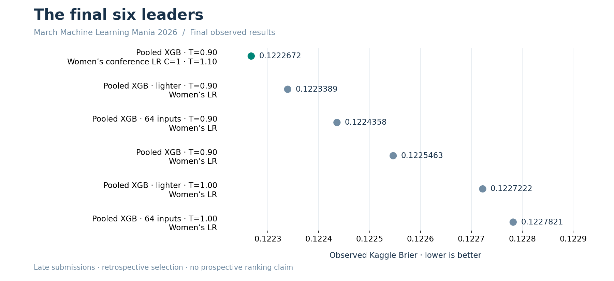

# NCAA tournament probability forecasting

**Observed Kaggle Brier: 0.1222672 · Scored release preserved · Feature research continuing**

A notebook-led machine-learning case study by **Alvaro Mendizabal**: pre-tournament information boundaries, probabilistic forecasting, domain-informed feature investigations, and explicit reporting of both positive and negative results.

## Start here

| Review path | What it contains |
|---|---|
| [Research extension portfolio](portfolio/README.md) | Recent user-executed investigations, aggregate evidence, and decisions |
| [Two-minute employer walkthrough](docs/employer_walkthrough.md) | Overview of the original scored release |
| [Observed results and model lineage](reports/final_results/README.md) | Winning file, model configuration, score provenance, and recovery |
| [Complete released score ledger](reports/final_results/kaggle_scores.csv) | The original 70 scored submissions |
| [Publication and privacy boundary](portfolio/DISCLOSURE.md) | What is public, what is withheld, and what remains unsynchronized |

## The observed result

The released winner combines **men's pooled XGBoost at temperature 0.90** with **women's conference logistic regression, C=1.0, at temperature 1.10**. Both supplied Kaggle score columns show **0.1222672**, compared with **0.1229419** for the original model pair. All 70 released submission files and their observed scores remain preserved in the original release records.

These were **late, retrospective submissions**. This is an observed score, not a prospective competition rank or an untouched-holdout estimate. The subsequent feature investigations have not established a new submission improvement.

The winning file is `m_pooled_xgboost_t090__w_conference_c100_t110.csv`, containing **132,133 rows**. The [machine-readable final record](reports/final_results/summary.json) preserves its byte identity and model provenance. The original 18 legacy observations remain separately labeled by their earlier lineage.

## What the project demonstrates

| Capability | Evidence |
|---|---|
| Domain-informed representation | Original 3,106-feature bank and separate 840-definition ranking study; subsequent controlled, bounded investigations |
| Temporal validation | Pre-tournament snapshots, earlier-season training, and training-only preprocessing and selection |
| Probability evaluation | Brier, log loss, calibration diagnostics, and paired comparisons on matched games |
| Experimental discipline | Declared hypotheses, add/remove-family comparisons, reuse of valid checkpoints, and negative-result retention |
| Reproducibility | Locked original environment, source/data fingerprints, exact prediction reload checks, and recorded artifact lineage |
| Presentation | Six original executed review notebooks, interactive released results, and a compact extension evidence portfolio |

The original release's **3,946 candidate definitions** are not a count of validated useful features. Broad feature banks and additional model capacity did not consistently beat compact representations. [Original feature evidence](reports/feature_store/README.md) and [individual-ranking evidence](reports/ranking_systems/README.md) retain those comparisons.

## Original review notebooks

The original six canonical notebooks and their published outputs are retained unchanged by this documentation update. These are release artifacts, not claims that newly prepared research notebooks have all executed successfully.

| Notebook | Review question |
|---|---|
| [00 · Data](notebooks/00_data_audit_and_preparation.ipynb) | What data exists, and where are its coverage and quality limits? |
| [01 · Validation](notebooks/01_split_protocol_and_pre_tournament_snapshots.ipynb) | What information is available before prediction? |
| [02 · Features](notebooks/02_feature_store_and_diagnostics.ipynb) | Which hypotheses help or fail controlled tests? |
| [03 · Models](notebooks/03_model_comparison_and_diagnostics.ipynb) | How do model and calibration choices compare on matched games? |
| [04 · Results](notebooks/04_locked_benchmark_and_final_submission.ipynb) | What was submitted and how are original predictions recovered? |
| [05 · Appendix](notebooks/05_feature_research.ipynb) | How does the original study compare with earlier feature schemas? |

The [interactive released-results report](reports/final_results/results.html) contains the original score charts and ledger. The extension portfolio adds measurements from supplied research reports without exposing new training implementation.

## Interpretation and limits

**The research extension remains open.** Ranking consensus improved a compact men's reference in three of four 2022–2025 comparisons, with mean-season Brier change **−0.0006879**. That is not a result for the stronger pooled production recipe. Transfer into the fixed production system remains pending.

The 2016–2019 development seasons, 2022–2025 benchmark, and 2026 leaderboard have already informed project decisions. They must not be represented as fresh untouched tests. Historical tournament subsets, pooled/individual populations, mean-season metrics, and Kaggle scores are not interchangeable.

The newest supplied collection contains completed reports for rounds 17–19 but no completed round 16 report. Rounds 20–21 are prepared only in the evidence available for this update. [The experiment ledger](portfolio/EXPERIMENT_LEDGER.md) distinguishes measured findings from pending work.

## Preservation and disclosure

This update adds **public aggregate evidence and documentation only**. It does not publish new private training source, raw data, fitted models, game-level predictions, credentials, or private checkpoint archives. It does not certify that the live AWS filesystem has been synchronized to GitHub.

Previously released source and history remain present under their existing MIT license; this is not a retroactive removal or relicensing. New implementation remains outside this public update. See [the exact disclosure boundary](portfolio/DISCLOSURE.md).

For the original reproducible release and private artifact recovery, use [the release handoff](reports/final_results/README.md), [research audit](docs/research_audit.md), and [Studio instructions](docs/studio.md). Original raw inputs, fitted estimators, and full prediction archives remain outside Git.

**License:** existing MIT-licensed source retains its license. Competition data remains subject to Kaggle's terms.
