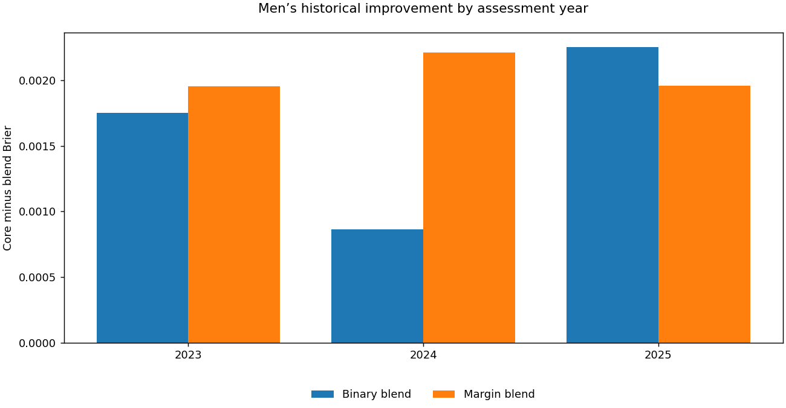

# NCAA tournament probability forecasting

**Alvaro Mendizabal · temporal validation · basketball representations · calibrated ensembles**

A notebook-led research and engineering project for men's and women's NCAA tournament
win probabilities. The work combines domain-informed feature construction, controlled
model comparisons, probability calibration, and restartable AWS experiments.

## Start with the evidence

**[Open the executed research case study](portfolio/current_research.ipynb)** ·
[Two-minute employer walkthrough](docs/employer_walkthrough.md) ·
[Methods, provenance and limitations](docs/current_research.md)

| Evidence | Result | What it establishes |
|---|---:|---|
| Best recorded late Kaggle submission | **0.1098691 Brier** | Scored two-feature men's incumbent; not an original competition placement |
| Published first-place reference | **0.1097454 Brier** | Author-reported 126-game benchmark, not our result |
| Latest historical men's core | **0.1795046 Brier** | 189 main-bracket games from reused 2023–2025 development seasons |
| Fixed 75% core / 25% margin ensemble | **0.1774648 Brier** | Improvement of **0.0020398** on those same historical games; not yet submitted |

Lower Brier is better. The late-score numerical gap is **0.0001237**. Historical
Brier cannot be subtracted from a Kaggle score to predict a new result. The
[aggregate evidence and score identity](reports/current_research/evidence.json)
separate these evaluation settings explicitly.



## The research result

Adding more basketball features did not automatically improve the compact reference.
Full-bundle fusion, residual principal components, nested subset selection and
frozen-core corrections were rejected. Changing the learning target to **actual
point margin**, while retaining a matched win/loss control, produced a useful
complement to the reference model.

The fixed margin blend improved on the stronger core in **all three assessment
years and for all three predeclared seeds**. It beat the matched binary-target blend
by **0.0004168 pooled Brier**, although that advantage occurred in only two of three
years. Its recorded decision is **candidate-build review**, not deployment or a
claim of beating the competition winner.

## What to inspect

| Artifact | Engineering or research evidence |
|---|---|
| [Current executed notebook](portfolio/current_research.ipynb) | Six inline Plotly figures with saved image fallbacks, negative results, objective ablation, season and seed stability |
| [Data audit](notebooks/00_data_audit_and_preparation.ipynb) | Input integrity, identifiers and point-in-time preparation |
| [Split protocol](notebooks/01_split_protocol_and_pre_tournament_snapshots.ipynb) | Whole-season assessment and prediction-time boundaries |
| [Feature diagnostics](notebooks/02_feature_store_and_diagnostics.ipynb) | Domain representation, leakage checks and feature comparisons |
| [Model comparison](notebooks/03_model_comparison_and_diagnostics.ipynb) | Earlier model lineages, calibration and comparative diagnostics |
| [Research engineering](research/README.md) | Existing implementation and experiment index |
| [Quality workflow](.github/workflows/ci.yml) | Existing compile, lint, type, test, release and notebook gates |

## Reproduce the publication without AWS

The current case study runs solely from committed aggregates. It does **not**
retrain models or fetch competition data.

```bash
uv sync --locked --group dev
uv run --locked python -m ipykernel install --user --name march-portfolio
uv run --locked python -m unittest discover -s portfolio -p 'test_current_research.py'
uv run --locked python portfolio/current_research.py --check
uv run --locked python portfolio/current_research.py --build --kernel march-portfolio
```

Saved charts can be inspected on GitHub without running anything. The Plotly MIME
outputs support interactive viewing in compatible Jupyter front ends; GitHub's
static view has embedded image fallbacks. A clean-kernel execution and reopened-file
checks protect against missing plots or unresolved cells.

## Publication boundary and status

**GitHub is the curated engineering and evidence layer; AWS is the experimental
workspace.** This release adds portable analysis, aggregate evidence, methodology
and verified report outputs. It is not a full synchronization of the newer AWS
training tree. Raw competition data, per-game private artifacts, fitted models,
virtual environments, credentials and local working changes remain outside Git.

The historical [70-submission release](reports/final_results/README.md), including
its **0.1222672** best score, is preserved unchanged as an earlier lineage—not
presented as the current best. Its existing integrity checks remain in place.

**Completed:** bounded margin robustness experiment and its research publication.
**Pending:** one frozen 2026 candidate build, schema/probability/protected-row checks,
and separately authorized scoring. Reused development years are not an independent
confirmation; the work does not establish prospective superiority.

The compact reference is adapted from
[Harrison Horan's first-place writeup](https://github.com/harrisonhoran/kaggle-march-mania-2026-1st-place/blob/main/kagglewriteup.md).
Credit, evaluation boundaries and reproduction limits are documented in the
[methods note](docs/current_research.md). Existing license and third-party notices
remain unchanged.
