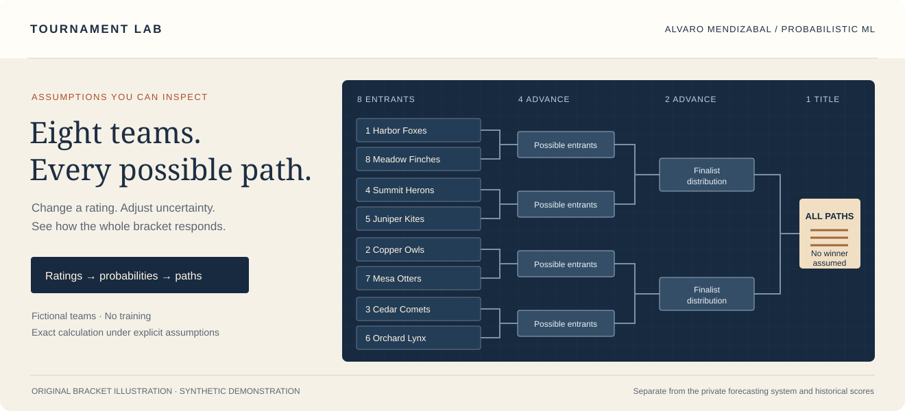

# NCAA tournament forecasting

**Alvaro Mendizabal · probability modeling · temporal data engineering · reproducible ML systems**

[](https://github.com/alvaromendizabal/march-machine-learning-mania-2026/actions/workflows/ci.yml)
[](https://github.com/alvaromendizabal/march-machine-learning-mania-2026/actions/workflows/current-research.yml)
[](https://github.com/alvaromendizabal/march-machine-learning-mania-2026/actions/workflows/public-demo.yml)

**I built and evaluated an auditable NCAA probability-forecasting system with a Kaggle-confirmed Brier score of 0.1067095: 2.77% lower than the official winning score of 0.1097454.**

This is a **late, post-outcome research result**, submitted October 8, 2026 after the March 19 deadline and after outcomes had been inspected. The **0.0030359 reduction in mean squared probability error** is measured; it is not an official first-place finish, an equal-information comparison, or evidence of prospective superiority.



**[Explore Tournament Lab](https://alvaro-tournament-lab.tartmacaw2.chatgpt.site)** · [Demo and local launch](docs/public_demo.md) · [Three-minute review](START_HERE.md) · [Engineering case study](docs/employer_walkthrough.md)

Tournament Lab runs in your browser: edit fictional teams' ratings and temperature, inspect exact bracket probabilities, and export the calculation with authored synthetic scoring diagnostics. It demonstrates probability reasoning without loading the private forecasting system or claiming a real tournament result.

## Three engineering results

- **A complete evaluation population.** I reconciled all **558 saved control predictions** and restored eight legitimate equal-seed games, producing a **566-game men's historical bank** across nine forecast seasons. Difficult matchups remain in the denominator.
- **Source and model checks that isolate errors.** I built a raw-game foundation spanning **42 men's and 29 women's seasons**, independently replayed features, and checked **65,703 women's probabilities within 1e-4** plus **66 core and 66 margin members** in the men's branch against matched inputs.
- **A delivered artifact with evidence.** I validated **132,133 matchup probabilities**, identities, ranges, hashes and replay records, then preserved the external submission receipt. Checkpoints, heartbeats and recoverable AWS jobs make failures inspectable and completed work reusable.

These are separate accomplishments. Later source acquisitions are not retrospectively credited with causing the submitted score improvement. [Architecture](docs/architecture.md) · [Source foundation](docs/reproducible_source_foundation.md) · [Validation matrix](docs/reproduction_matrix.md)

## Measured result

| Evidence | Brier ↓ | Scope |
|---|---:|---|
| **My confirmed submission** | **0.1067095** | Kaggle late submission; public/private scores agree; COMPLETE |
| Official winning reference, Harrison Horan / harry | 0.1097454 | Original competition final leaderboard |
| Matched local method baseline | 0.1099121050 | Separate retrospective audit of 126 played games |
| Previous project submission | 0.1206458 | Earlier late-submission control |

On the matched 126-game audit, the men's branch improves from **0.1430858925 to 0.1366807914**, or **4.48%**, while the women's branch remains approximately **0.0767383172**. The combined matched reduction is **2.91%**. This local baseline is distinct from the official winning score; branch-level changes do not establish the causal effect of each input.

I integrated gender-specific modeling, calibration and complementary archived pregame information, with source timing and coverage checks. The system builds on credited public methods; [comparison and method lineage](docs/benchmark_comparison.md) preserve that attribution and the limits of the evidence.

[Confirmed receipt](reports/verified_result/submission_receipt.json) · [Executed result notebook](portfolio/verified_result.ipynb) · [Metric evidence](reports/verified_result/reproduction.json)

## Run the public audit

With Python 3.12, no credentials, competition data, GPU or model downloads:

```bash
git clone https://github.com/alvaromendizabal/march-machine-learning-mania-2026.git
cd march-machine-learning-mania-2026
python portfolio/reproduce_release.py --check
```

This recomputes aggregate comparisons and verifies published receipt hashes and disclosures. It does not regenerate private forecasts or independently rescore withheld prediction rows. [Start here](START_HERE.md) includes the locked environment, six canonical review notebooks and browser-demo checks.

## Current boundary

The **0.1067095 result remains the latest confirmed score**. The latest inspected execution return, **v128, completed October 10, 2026**, ended **SOURCE_PARTIAL**: it repaired 2,258 market-quote rows while retaining 1,075 rows with missing last quotes. It admitted no model and performed **zero fits, inferences, candidates or submissions**. Historical promotion gates remain unmet; exact injury inputs and broader timing-qualified source coverage remain open.

A 2026-as-incoming feature rehearsal is complete. A full acquisition-to-forecast run and prospective 2027 validation are still required. [Current research](docs/current_research.md) · [Inspected execution receipt](portfolio/latest_execution.json) · [2027 readiness](docs/2027_readiness.md)

Published materials include public research code, tests, executed notebooks, aggregate evidence and source lineage. Private composition rules, fitted models, forecast rows, supplemental archives and cloud state remain outside this release. Existing licenses and source credits remain intact. [Disclosure](portfolio/DISCLOSURE.md)

**Stack:** Python · pandas · scikit-learn · XGBoost · LightGBM · Plotly · AWS SageMaker · GitHub Actions.
