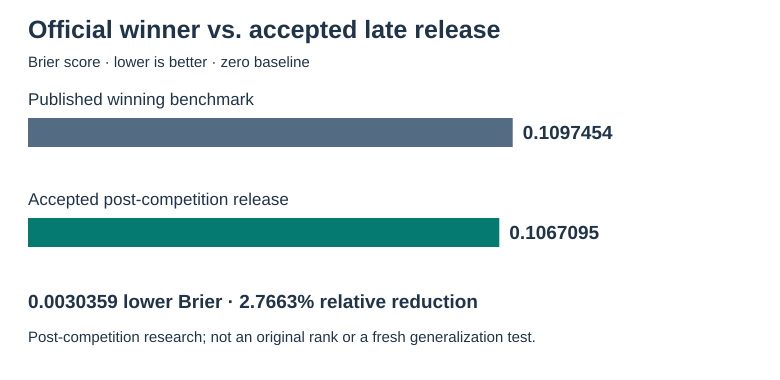

# NCAA tournament forecasting

**Alvaro Mendizabal · probabilistic machine learning · source reconstruction · AWS research engineering**

[](https://github.com/alvaromendizabal/march-machine-learning-mania-2026/actions/workflows/ci.yml)
[](https://github.com/alvaromendizabal/march-machine-learning-mania-2026/actions/workflows/current-research.yml)

## The result

**Kaggle-confirmed Brier: 0.1067095 — 2.77% lower than the official winning score of 0.1097454.**

This is a **post-competition research result**, submitted October 8, 2026 UTC, after the March 19 competition deadline and after outcomes had been inspected. It is a numerical benchmark comparison, not an official first-place finish or evidence of prospective superiority. The improvement is **0.0030359 Brier**, or **2.77% less mean squared probability error**; it is not an accuracy percentage or a statistical-significance claim.

| Result | Brier ↓ | Evaluation context |
|---|---:|---|
| **This project's confirmed submission** | **0.1067095** | Kaggle late submission, public/private scores, COMPLETE |
| Official winning reference, Harrison Horan / harry | 0.1097454 | Original competition final leaderboard |
| First-place-method reconstruction | 0.1099121050 | Matched local 126-game retrospective audit |
| Previous project submission | 0.1206458 | Earlier late-submission control |

The submitted file contains **132,133 matchup probabilities**. The exact local audit covers **126 played games**, split evenly between the men's and women's tournaments. [Submission receipt](reports/verified_result/submission_receipt.json) · [Comparison, context, and sources](docs/benchmark_comparison.md)



**Review in five minutes:** [Start here](START_HERE.md) → [Executed result notebook](portfolio/verified_result.ipynb) → [Employer walkthrough](docs/employer_walkthrough.md) → [Architecture](docs/architecture.md)

## How the result was built

A strong public method supplied a reference for an extensive reconstruction program. The work separated four problems that are often mixed together: **source equivalence, model equivalence, complementary information, and reliable delivery**.

1. **Reconstruct the forecasting core.** Separate men's and women's models preserve their different probability distributions. The women's compact XGBoost/calibration branch reproduced **65,703 pairwise probabilities within 1e-4** of an archived reference. Men's same-input checks reconciled **66 core members and 66 margin members**, isolating modeling differences from input differences.
2. **Recover useful information from its sources.** Official game records and ranking inputs support independent rating construction. Dated pregame BPI and market observations supplied complementary probability information in the submitted research lineage. Exact private composition rules remain withheld.
3. **Preserve the strong branch; improve the weaker branch.** Against the reconstructed method, observed men's Brier improved from **0.1430858925 to 0.1366807914**, a **4.48% reduction**. Women's Brier remained approximately **0.0767383172**. The resulting matched combined improvement was **2.91%**. These are measured component-level differences, not causal proof that any one feature produced the entire gain.
4. **Make the delivered artifact auditable.** Validate every required matchup, probability range, identity, and file hash; retain replay evidence; then verify the external submission response. Generation, submission, and historical model promotion are separate lifecycle events.

The approach builds on the winning solution with attribution. Its authors' compact design and competition-time judgment provide a valuable baseline. Our [comparison](docs/benchmark_comparison.md) explains the additional research scope and the limitations that remain on both sides of the numerical comparison.

## Engineering depth behind the score

| Capability | Evidence | Why it matters |
|---|---|---|
| Broad source foundation | **42 men's / 29 women's raw seasons**; 13,753 / 9,851 team-season rows | Reusable data engineering across historical regimes |
| Complete historical identity bank | **566** men's tournament games across nine forecast seasons | Prevents selective omission of difficult matchups |
| Independent replay | Raw-to-feature reproduction and same-input model reconciliation | Distinguishes implementation errors from failed hypotheses |
| Temporal contracts | Cutoff checks, explicit missingness, source-version records, future-row poison tests | Makes availability assumptions inspectable |
| Controlled research | Development/confirmation controls; rejected experiments retained | Resists promotion based on a favorable slice |
| Bounded AWS execution | Resume checkpoints, process-tree limits, progress telemetry, diagnostic returns | Makes iterative research economical and recoverable |
| Public auditability | Executable aggregate checks, result notebook, source citations, CI | Gives reviewers a concrete way to inspect the claims |

The broad foundation is engineering evidence. It is **not** a claim that every later source or experiment caused the submitted score improvement. [Foundation evidence](docs/reproducible_source_foundation.md) · [Reproduction matrix](docs/reproduction_matrix.md)

## Reproduce the public result audit

The lightweight audit uses Python 3.12's standard library and needs no credentials, competition data, GPU, or model downloads:

```bash
git clone https://github.com/alvaromendizabal/march-machine-learning-mania-2026.git
cd march-machine-learning-mania-2026
python portfolio/reproduce_release.py --check
```

It verifies the sanitized delivery receipt, source-document hashes, exact decimal score comparisons, the full historical denominator, and disclosure flags. The [executed notebook](portfolio/verified_result.ipynb) makes the evidence readable; [machine-readable results](reports/verified_result/reproduction.json) make it inspectable.

**Reproduction scope:** this recomputes aggregate comparisons and checks published evidence. It does not regenerate the private forecast or independently rescore its withheld row-level predictions. The repository also retains a tested public research framework and six canonical review notebooks; their locked-environment review instructions and lineage boundaries are in [Start here](START_HERE.md).

## Research status and limits

The **0.1067095 submission is confirmed**. The same lineage has **not passed every historical promotion gate**, and the 2026 outcomes were repeatedly inspected. It remains a retrospective research release rather than a certified future-season champion. This distinction is intentionally preserved in the [result evidence](portfolio/release_evidence.json).

Current source work addresses broad original player histories, dated availability, historical market/BPI coverage, and future-season acquisition. The latest v99 original-boxscore pilot is **built and locally tested, awaiting its owner-run return** at this publication snapshot. It has not generated a new model or score. Some older player archives are third-party-derived NCAA records, not original ESPN records; their identifiers and ownership claims remain separate.

A 2026-as-incoming **feature** rehearsal has completed. A complete new-season acquisition-to-forecast run and actual 2027 validation remain open. [Current research](docs/current_research.md) · [2027 readiness](docs/2027_readiness.md)

## Selective reproducibility

Published: aggregate results, metric arithmetic, source categories, evaluation populations, reconstruction evidence, architecture, tests, executed notebooks, and public research code.

Withheld from this release: private blend weights and transforms, row-level private forecasts, submission CSVs, fitted private models, raw supplemental archives, source-specific private identity rules, and AWS execution bundles. Existing published code and license grants remain intact. [Disclosure boundary](portfolio/DISCLOSURE.md)

**Stack:** Python · pandas · scikit-learn · XGBoost · LightGBM · Plotly · AWS SageMaker · GitHub Actions.
