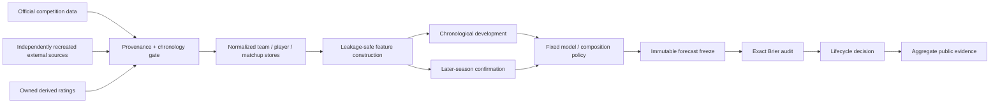
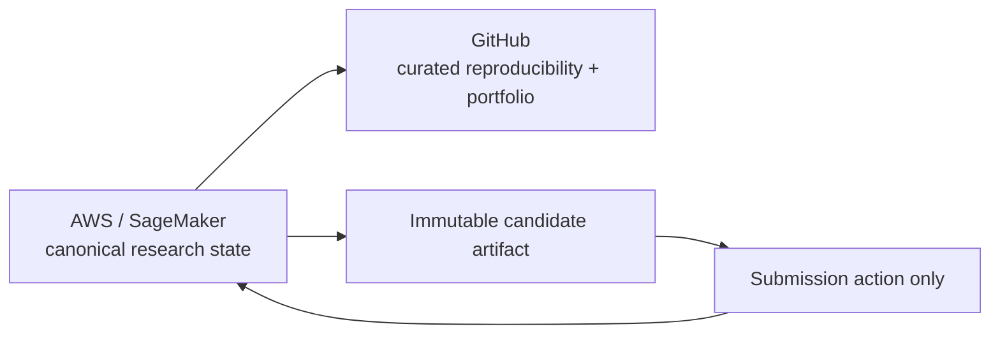
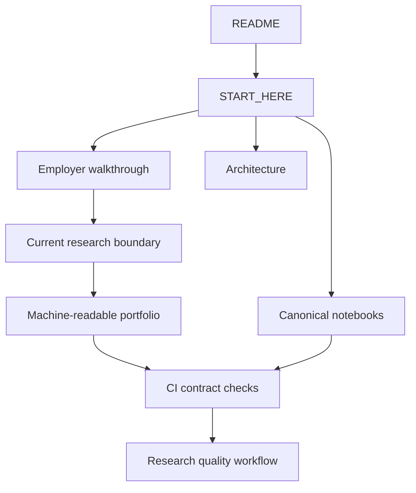

# System architecture

## Research system

The architecture deliberately separates **source eligibility**, **historical model evaluation**, and **final retrospective audit**. A lower audit score alone does not override failed historical promotion gates.

## Execution and publication flow

AWS is the source of truth for active research. GitHub is the versioned employer-facing evidence layer.

## Major layers

### 1. Source and provenance

The project accepts three broad input classes:

- official competition data;
- external observations independently reacquired from original or authoritative sources;
- metrics derived internally from accepted raw data.

Each external source is evaluated independently for raw integrity, capture time, publication semantics, entity mapping, feature eligibility, and historical transfer.

### 2. Feature system

The public feature system includes:

- team performance and efficiency;
- pace and possessions;
- shooting, rebounding, turnover, and free-throw structure;
- schedule and opponent context;
- Elo / SRS / Colley / Bradley-Terry families;
- Massey context;
- chronology-aware polling information;
- conference and coach context where source coverage supports it.

Learned preprocessing is fitted inside the appropriate historical training partition.

### 3. Evaluation

The project keeps distinct evidence populations:

- chronological development;
- later-season confirmation;
- the complete historical main-bracket control bank;
- the exact 126-game 2026 retrospective audit;
- submitted external results.

This separation prevents a favorable final audit from silently becoming proof of generalization.

### 4. Model and reproduction layer

The codebase supports regularized linear models, gradient boosting, margin-to-probability conversion, calibration, pairwise matchup modeling, and fixed ensemble policies.

Reproduction work is checked at component level: feature semantics, model best iterations, calibration parameters, prediction parity, and complete evaluation populations.

### 5. Research operations

Substantial AWS runners use:

- preflight gates;
- deterministic checks;
- checkpoints and resume;
- immutable manifests;
- source / artifact hashes;
- timestamped heartbeats;
- JSONL telemetry;
- resource and cost accounting;
- diagnostic packaging on failure or timeout.

## Public evidence architecture

The public tree is curated around the canonical package, notebooks, tests, reports, portfolio summaries, and provenance evidence. Duplicate private workspaces are preserved in Git history rather than exposed as current navigation paths.
